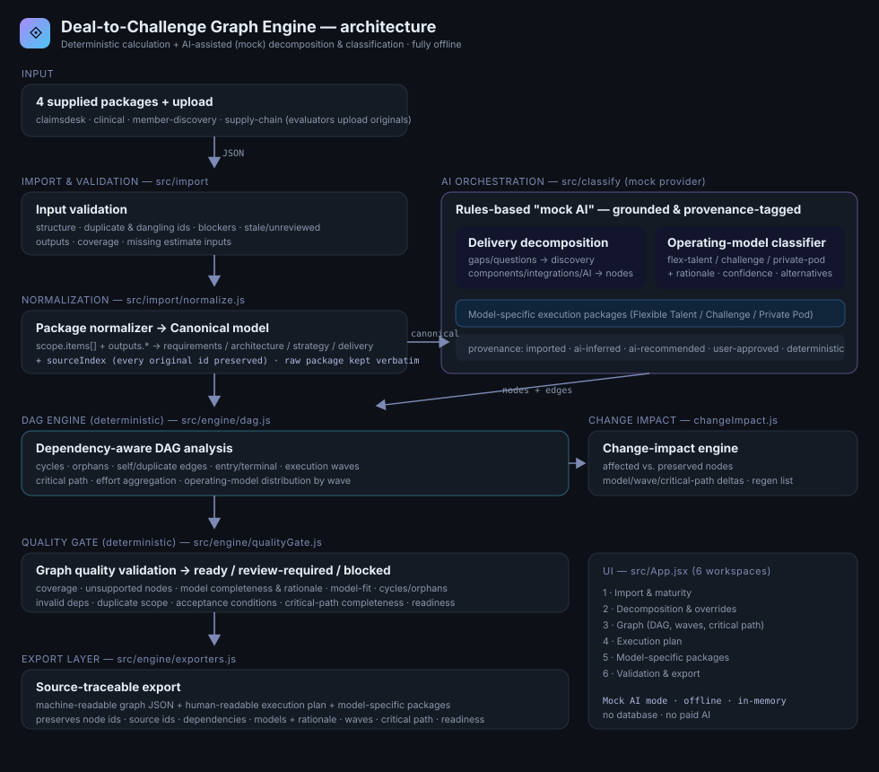

# Deal-to-Challenge Graph Engine

Transforms deal-scoping JSON packages into an **execution-ready Directed Acyclic
Graph** of delivery nodes, each classified into one of Topcoder's three operating
models — **Flexible Talent**, **Challenge**, or **Private Pod** — with an
explainable rationale, full source traceability, and a deterministic quality gate.

It behaves like a *deal-to-execution compiler*: it validates and normalizes the
package, assesses maturity, decomposes the solution into grounded work nodes,
classifies each node's operating model, builds a dependency-aware DAG, computes
execution waves and the critical path, generates model-specific execution
packages, analyses change impact, and exports source-traceable artifacts.

**Stack:** React + Vite (JavaScript). A **deterministic engine** does all
calculation; an **AI-assisted (mock-mode, rules-based) layer** does the judgment
calls. Runs fully offline — no paid AI required.



---

## Run it locally

Requires Node 18+.

```bash
npm install
npm run dev        # opens http://localhost:5173
```

Other scripts:

```bash
npm run build      # production build to dist/
npm run preview    # serve the production build
npm test           # headless engine tests (52 checks against the 4 real packages)
npm run samples    # regenerate sample outputs in samples/
```

No environment variables, no accounts, no network calls. The four supplied
packages are bundled under `public/inputs/` for one-click loading, and evaluators
can also **upload the original files directly** (Import workspace → *Upload JSON*).

## Demo

> **Video:** _add your 3–5 min screen recording link here._

Suggested walkthrough: import a package → review maturity & blockers → run
decomposition → review Flexible Talent / Challenge / Private Pod classifications
and their rationale → open the DAG (mixed-model, waves, critical path) → override
an operating model and review the change impact → run the quality gate → export
the graph JSON and a model-specific package → all in mock mode.

---

## The six workspaces

1. **Import** — load a supplied package or upload one; see validation, the
   normalized package summary, **package maturity**, and blockers/gaps/questions.
2. **Decomposition** — the generated delivery-node inventory; inspect any node's
   scope, grounding, deliverables, acceptance conditions, and operating model;
   **override** the model or mark a node blocked.
3. **Graph** — the DAG, colored by operating model, with the critical path
   highlighted, plus cycle/orphan/entry/terminal detection.
4. **Execution Plan** — execution waves, operating-model distribution per wave,
   effort, and the critical path.
5. **Packages** — the model-specific execution package for each node
   (Flexible Talent / Challenge / Private Pod shapes).
6. **Validation & Export** — traceability & coverage, the quality gate, change
   impact, and export of graph JSON + a human-readable execution plan.

---

## How decomposition works

Decomposition is grounded in the imported ids — it never invents requirements,
contracts, security details, or acceptance conditions. Nodes are generated from:

- **Critical gaps/questions** → **blocking discovery** nodes (they block the
  implementation nodes that share their related ids).
- **Non-critical open items** → review-required clarification nodes.
- **Integrations** (`strategy.integrations`) → integration nodes (marked
  review-required when a protocol/auth contract is missing — not fabricated).
- **AI use cases** → AI-implementation nodes (regulated/human-review aware).
- **Data domains / data requirements** → a data-platform & migration node.
- **Security requirements** → a security & compliance node.
- **Personas + functional scope** → a UX exploration node.
- **Architecture component areas** → coordinated build nodes.
- Plus **testing** and **deployment** nodes.

Dependencies are wired from real relationships (blocking discovery, design
handoff, data/security foundations, integration dependencies, verification,
release gate), and every node is guaranteed to be connected and grounded.

## Operating-model classification

Each node is scored against the three models from its work characteristics and
assigned the best fit **with a rationale** (never defaulting to Challenge):

- **Flexible Talent** — a focused task for one specialist with known skills
  (discovery assessments, single-role work).
- **Challenge** — bounded, measurable, independently deliverable work that
  benefits from multiple approaches and needs no sensitive access (UX
  exploration, bounded components).
- **Private Pod** — coordinated, coupled, restricted-access, or regulated work
  needing sustained technical ownership (platform builds, regulated AI, coupled
  integration).

Each classification records: `primary`, `alternatives`, `confidence`,
`rationale[]`, `sourceIds`, and (when a user overrides it) an `overrideHistory`.
All four supplied packages produce **mixed-model** graphs.

## Deterministic vs. AI-assisted

| Deterministic (reproducible) | AI-assisted (mock-mode rules, provenance-tagged) |
|---|---|
| Reference/ID validation, duplicate & dangling detection | Delivery decomposition (node boundaries) |
| Package maturity scoring | Operating-model recommendation + rationale |
| Cycle, orphan, self/duplicate-edge detection | Dependency suggestions |
| Execution waves (topological layering) | Role/skill & acceptance drafting |
| Critical path, effort aggregation | Execution-package content |
| Coverage, classification completeness | Change-impact explanation |
| Quality-gate status, export readiness | |

**Provenance** is tracked per output (`imported` / `ai-inferred` /
`ai-recommended` / `user-created` / `user-approved` / `deterministic`). A generic
"generated by AI" badge is deliberately avoided — every node exposes its source
ids, rationale, and (for overrides) the recorded user decision.

## Maturity assessment

Packages are classified **execution-candidate / review-required /
discovery-required / blocked** from critical gaps/questions, estimate confidence,
missing inputs, unreviewed/stale outputs, coverage, and quality fails. Example
results on the supplied packages: the early-discovery package →
**discovery-required** (9 critical items, Low confidence); the others →
**review-required**. Incomplete packages produce discovery/clarification work
and keep affected implementation nodes review-required or blocked.

---

## Architecture

```
Input (upload / 4 bundled)  ──►  Import & Validate ──►  Normalizer ──►  Canonical model
                                  (structure, dup/dangling ids,            (+ sourceIndex)
                                   blockers, stale, coverage)                     │
                                                                                  ▼
  Export layer ◄── Quality gate ◄── DAG engine ◄── Decomposition + Operating-model
 (graph JSON,      (ready/review/   (waves, critical  classifier  (mock AI provider:
  plan, packages)   blocked)         path, cycles)     rules-based, grounded, labelled)
        ▲                                   ▲                         │
        └────────── Change-impact engine ───┴─────────────────────────┘
```

### Layout

```
src/
  model/      canonical.js         — canonical model shape + helpers
  import/     normalize.js · validate.js · importPackage.js
  engine/     maturity.js · dag.js · buildGraph.js · qualityGate.js
              changeImpact.js · exporters.js · pipeline.js
  classify/   decompose.js · classify.js · packages.js   (the "mock AI" layer)
  ui/         styles.js · GraphView.jsx
  App.jsx     six workspaces + DAG + overrides + change-impact + export
public/inputs/  the four supplied packages (for one-click load)
test/         engine.test.mjs (52 checks) + fixtures (the four packages)
samples/      graph JSON, plan, quality-gate for all four + one package per model
docs/         architecture.svg · source-to-canonical-mapping.md
```

See **`docs/source-to-canonical-mapping.md`** for the full field mapping,
identifier-preservation rules, ignored sections, and compatibility assumptions.

---

## Data & persistence

The app uses an **in-memory store only** (React state) — no database, per the
challenge guidance that an in-memory store is sufficient. The imported package is
preserved unchanged in memory for audit/comparison; the normalized model is
derived alongside it. Reloading resets the session.

## Optional live AI

The decomposition/classification layer sits behind a single interface and
defaults to the deterministic mock provider (so all four packages run offline).
A live-AI provider can be wired in the same place to draft node boundaries and
rationale, while the deterministic engine (validation, waves, critical path,
quality gate) stays unchanged. Paid AI is never required.

## Known limitations

- Decomposition granularity is rules-driven (grounded, reproducible) rather than
  free-form; it favors clear, defensible node boundaries over exhaustive detail.
- Effort estimates for derived nodes use category/complexity heuristics
  (`deterministic` provenance) where the source estimate doesn't map 1:1.
- Mock-mode rationale is templated from real signals; a live provider would
  produce more narrative wording (same structure, same grounding).
- The graph is a planning aid only — the app never recruits talent, launches a
  challenge, builds a pod, approves funding, or commits timelines.

## Testing

`npm test` runs 52 checks against the four real packages: all import with IDs
preserved; every node has exactly one operating model with a rationale;
mixed-model support and "not everything is a Challenge"; discovery nodes for
gaps/questions; cycle/orphan detection; correct waves & critical path; override
detection with unaffected-node preservation; exports preserve models, rationales
& dependencies; and mock mode compiles all four offline.
